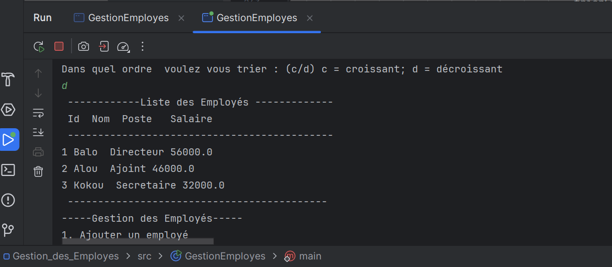

<h1>Rapport</h1>
Lorsque je test de ma méthode ajouterEmploye, une exception NullPointerException a été levé parceque la case j ne contient pas d'objet. Ce qui fait que l'invocation de methode getId() génère l'exception. Cette erreur se situe au niveau de la ligne 42 de la classe principale GestionEmployes.
Cf figure 1

fig 1 : Exceptoion NullPointerException suite à l'execution de la méthode ajouterEmploye  
Après correction de l'exception, la méthode ajouterEmploye a marché et la méthode afficherEmployes() affiche les deux employés que contient le tableau.  
Cf figure 2

fig 2 : Affichage des employés grâce à la méthode afficherEmployes()  
Selon le critère de recherche, dans la méthode rechercherEmploye, nous avons utilisés l'opérateur OU. Ainsi la méthode fournira un résultat de recherche selon que le critère correspond au nom ou au poste. l'execution de cette fonction 
donne la figure ci-dessous cf fig 3

fig 3: Recherche d'un employé par nom ou par post  
Pour le calcul de la masse salariale, il n'y a pas eu de particularité à signaler. le test a marché cf fig 2

Méthode de trie :  
Pour la fonction trierEmployesParSalaire nour avons utilisé la méthode static compareParSalaire qui compare une liste d'employée par salaire.  
le test en order décroissant fournit le résultat suivant:
.

